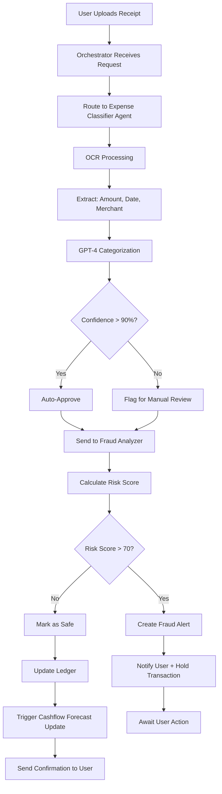
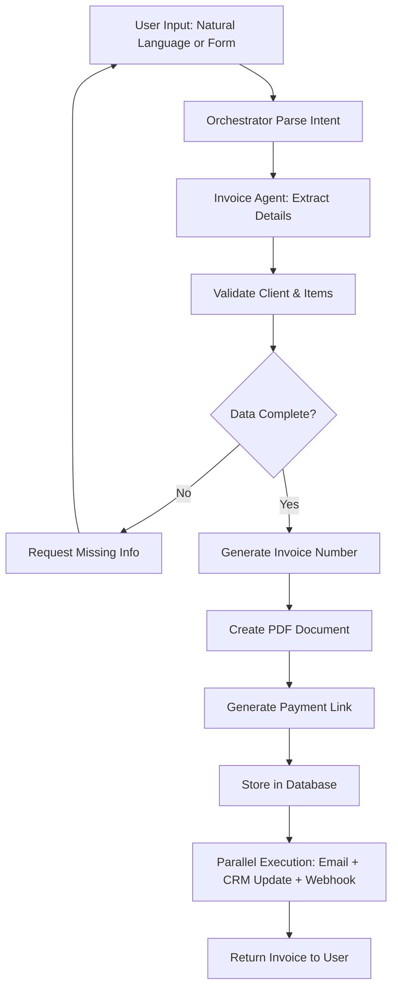
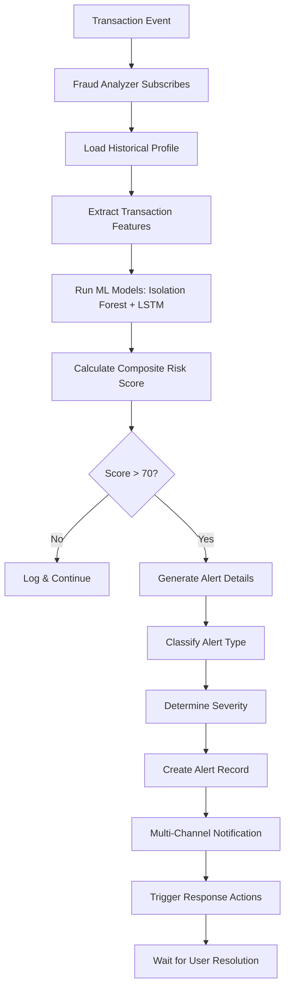
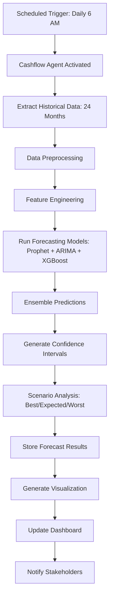

# FinAgent Pro - Core Workflows

## 🔄 Complete Workflow Definitions

---

## 1. Expense Processing Workflow

### Overview
End-to-end automation from receipt upload to ledger entry with fraud detection.

### Workflow Steps



### Detailed Implementation

```python
# Workflow Definition for watsonx Orchestrate

expense_processing_workflow = {
    "workflow_id": "expense_processing_v1",
    "name": "Expense Processing Pipeline",
    "trigger": {
        "type": "api_call",
        "endpoint": "/api/v1/expenses/upload"
    },
    "steps": [
        {
            "step_id": "1",
            "name": "Receive Upload",
            "agent": "orchestrator",
            "action": "validate_input",
            "inputs": ["receipt_file", "user_id"],
            "outputs": ["receipt_id", "file_url"],
            "timeout": "10s"
        },
        {
            "step_id": "2",
            "name": "OCR & Classification",
            "agent": "expense_classifier",
            "action": "process_receipt",
            "inputs": ["receipt_id", "file_url"],
            "outputs": [
                "amount",
                "date",
                "merchant",
                "category",
                "line_items",
                "confidence_score"
            ],
            "timeout": "30s",
            "retry": {
                "max_attempts": 3,
                "backoff": "exponential"
            }
        },
        {
            "step_id": "3",
            "name": "Confidence Check",
            "agent": "orchestrator",
            "action": "evaluate_condition",
            "condition": "confidence_score >= 0.90",
            "branch": {
                "true": "step_4",
                "false": "step_3a"
            }
        },
        {
            "step_id": "3a",
            "name": "Manual Review Queue",
            "agent": "orchestrator",
            "action": "flag_for_review",
            "notification": {
                "type": "email",
                "template": "manual_review_required"
            },
            "next": "step_4"
        },
        {
            "step_id": "4",
            "name": "Fraud Analysis",
            "agent": "fraud_analyzer",
            "action": "analyze_transaction",
            "inputs": [
                "amount",
                "merchant",
                "category",
                "user_id",
                "historical_data"
            ],
            "outputs": [
                "risk_score",
                "anomaly_flags",
                "explanation"
            ],
            "timeout": "5s"
        },
        {
            "step_id": "5",
            "name": "Risk Evaluation",
            "agent": "orchestrator",
            "action": "evaluate_condition",
            "condition": "risk_score > 70",
            "branch": {
                "true": "step_5a",
                "false": "step_6"
            }
        },
        {
            "step_id": "5a",
            "name": "Fraud Alert",
            "agent": "orchestrator",
            "action": "create_alert",
            "notification": {
                "type": "push + email",
                "priority": "high",
                "template": "fraud_detected"
            },
            "status": "hold",
            "next": "step_end"
        },
        {
            "step_id": "6",
            "name": "Update Ledger",
            "agent": "orchestrator",
            "action": "create_ledger_entry",
            "inputs": [
                "expense_data",
                "classification",
                "user_id"
            ],
            "outputs": ["ledger_id", "entry_timestamp"]
        },
        {
            "step_id": "7",
            "name": "Update Forecast",
            "agent": "cashflow_forecast",
            "action": "incremental_update",
            "inputs": ["new_expense_data"],
            "async": true
        },
        {
            "step_id": "8",
            "name": "Notify User",
            "agent": "orchestrator",
            "action": "send_notification",
            "notification": {
                "type": "push",
                "template": "expense_processed"
            }
        }
    ],
    "error_handling": {
        "strategy": "rollback",
        "notification": true
    },
    "sla": {
        "max_duration": "60s",
        "alert_threshold": "45s"
    }
}
```

### Success Criteria
- ✅ Processing time < 10 seconds
- ✅ OCR accuracy > 95%
- ✅ Classification accuracy > 92%
- ✅ Zero data loss

---

## 2. Invoice Creation Workflow

### Overview
AI-powered invoice generation from natural language or structured data.

### Workflow Steps



### Detailed Implementation

```python
# Invoice Creation Workflow

invoice_creation_workflow = {
    "workflow_id": "invoice_creation_v1",
    "name": "Conversational Invoice Generation",
    "trigger": {
        "type": "multiple",
        "sources": ["chat", "api", "form"]
    },
    "steps": [
        {
            "step_id": "1",
            "name": "Parse Input",
            "agent": "invoice_agent",
            "action": "extract_invoice_details",
            "inputs": ["user_input", "context"],
            "outputs": {
                "client_id": "string",
                "client_name": "string",
                "items": "array",
                "total_amount": "number",
                "due_date": "date",
                "notes": "string",
                "confidence": "float"
            },
            "model": "gpt-4",
            "prompt_template": "invoice_extraction"
        },
        {
            "step_id": "2",
            "name": "Validate Data",
            "agent": "invoice_agent",
            "action": "validate_invoice_data",
            "validations": [
                "client_exists",
                "items_valid",
                "amount_positive",
                "date_future"
            ],
            "outputs": ["is_valid", "missing_fields"]
        },
        {
            "step_id": "3",
            "name": "Check Completeness",
            "agent": "orchestrator",
            "action": "evaluate_condition",
            "condition": "is_valid == true AND missing_fields.length == 0",
            "branch": {
                "true": "step_4",
                "false": "step_3a"
            }
        },
        {
            "step_id": "3a",
            "name": "Request Missing Info",
            "agent": "invoice_agent",
            "action": "generate_clarification",
            "outputs": ["clarification_message"],
            "response": "interactive",
            "next": "step_1"
        },
        {
            "step_id": "4",
            "name": "Generate Invoice Number",
            "agent": "invoice_agent",
            "action": "create_invoice_number",
            "format": "INV-{YYYY}{MM}-{SEQUENCE}",
            "outputs": ["invoice_number"]
        },
        {
            "step_id": "5",
            "name": "Create PDF",
            "agent": "invoice_agent",
            "action": "generate_pdf",
            "inputs": [
                "invoice_data",
                "company_branding",
                "template"
            ],
            "outputs": ["pdf_url", "pdf_content"],
            "storage": "s3"
        },
        {
            "step_id": "6",
            "name": "Generate Payment Link",
            "agent": "invoice_agent",
            "action": "create_payment_link",
            "provider": "stripe",
            "inputs": ["invoice_number", "amount", "client_email"],
            "outputs": ["payment_url", "payment_id"]
        },
        {
            "step_id": "7",
            "name": "Store Invoice",
            "agent": "orchestrator",
            "action": "database_insert",
            "table": "invoices",
            "outputs": ["invoice_id"]
        },
        {
            "step_id": "8",
            "name": "Parallel Notifications",
            "agent": "orchestrator",
            "action": "parallel_execute",
            "tasks": [
                {
                    "task": "send_email",
                    "to": "client_email",
                    "template": "invoice_delivery",
                    "attachments": ["pdf_url"]
                },
                {
                    "task": "update_crm",
                    "entity": "client",
                    "action": "add_invoice_record"
                },
                {
                    "task": "trigger_webhook",
                    "url": "accounting_system_webhook",
                    "payload": "invoice_data"
                }
            ],
            "wait_for_all": false
        },
        {
            "step_id": "9",
            "name": "Return Response",
            "agent": "orchestrator",
            "action": "format_response",
            "outputs": {
                "invoice_number": "string",
                "pdf_url": "string",
                "payment_url": "string",
                "status": "sent"
            }
        }
    ],
    "sla": {
        "max_duration": "15s"
    }
}
```

### Example Conversational Flow

```
User: "Create an invoice for Acme Corp for the website redesign project, $8,500"

Agent: "I'll create that invoice. When should it be due?"

User: "Net 30"

Agent: ✅ Invoice INV-202511-0042 created
       📄 PDF: [Download]
       💳 Payment Link: [Pay Now]
       📧 Sent to: billing@acmecorp.com
```

---

## 3. Fraud Detection Workflow

### Overview
Real-time anomaly detection and alert generation for suspicious transactions.

### Workflow Steps



### Detailed Implementation

```python
# Fraud Detection Workflow

fraud_detection_workflow = {
    "workflow_id": "fraud_detection_v1",
    "name": "Real-time Fraud Analysis",
    "trigger": {
        "type": "event_stream",
        "source": "transaction_events",
        "filter": "amount > 100"  # Only analyze significant transactions
    },
    "steps": [
        {
            "step_id": "1",
            "name": "Event Ingestion",
            "agent": "fraud_analyzer",
            "action": "receive_transaction",
            "inputs": [
                "transaction_id",
                "user_id",
                "amount",
                "merchant",
                "category",
                "timestamp",
                "location"
            ]
        },
        {
            "step_id": "2",
            "name": "Load User Profile",
            "agent": "fraud_analyzer",
            "action": "fetch_historical_data",
            "inputs": ["user_id"],
            "lookback": "90_days",
            "outputs": {
                "avg_transaction": "float",
                "std_transaction": "float",
                "frequent_merchants": "array",
                "typical_categories": "array",
                "transaction_count": "int"
            }
        },
        {
            "step_id": "3",
            "name": "Feature Engineering",
            "agent": "fraud_analyzer",
            "action": "extract_features",
            "features": [
                "amount_zscore",
                "merchant_novelty",
                "time_since_last",
                "velocity_1h",
                "velocity_24h",
                "location_distance",
                "category_match"
            ]
        },
        {
            "step_id": "4",
            "name": "ML Model Inference",
            "agent": "fraud_analyzer",
            "action": "run_models",
            "models": [
                {
                    "name": "isolation_forest",
                    "weight": 0.4,
                    "threshold": 0.6
                },
                {
                    "name": "lstm_sequence",
                    "weight": 0.3,
                    "input": "last_10_transactions"
                },
                {
                    "name": "rule_engine",
                    "weight": 0.3,
                    "rules": "fraud_rules.yaml"
                }
            ],
            "outputs": [
                "model_scores",
                "composite_score",
                "contributing_factors"
            ]
        },
        {
            "step_id": "5",
            "name": "Risk Evaluation",
            "agent": "fraud_analyzer",
            "action": "calculate_risk",
            "formula": "weighted_average(model_scores)",
            "outputs": ["risk_score", "confidence"]
        },
        {
            "step_id": "6",
            "name": "Threshold Check",
            "agent": "orchestrator",
            "action": "evaluate_condition",
            "condition": "risk_score > 70",
            "branch": {
                "true": "step_7",
                "false": "step_6a"
            }
        },
        {
            "step_id": "6a",
            "name": "Log Safe Transaction",
            "agent": "orchestrator",
            "action": "log_event",
            "level": "info",
            "next": "step_end"
        },
        {
            "step_id": "7",
            "name": "Alert Classification",
            "agent": "fraud_analyzer",
            "action": "classify_alert",
            "types": [
                "unusual_amount",
                "suspicious_merchant",
                "rapid_transactions",
                "location_anomaly",
                "category_mismatch"
            ],
            "outputs": ["alert_type"]
        },
        {
            "step_id": "8",
            "name": "Severity Assessment",
            "agent": "fraud_analyzer",
            "action": "determine_severity",
            "rules": {
                "critical": "risk_score > 90",
                "high": "risk_score > 80",
                "medium": "risk_score > 70"
            },
            "outputs": ["severity"]
        },
        {
            "step_id": "9",
            "name": "Create Alert",
            "agent": "orchestrator",
            "action": "database_insert",
            "table": "fraud_alerts",
            "data": {
                "transaction_id": "ref",
                "alert_type": "ref",
                "severity": "ref",
                "risk_score": "ref",
                "explanation": "generated",
                "status": "open"
            },
            "outputs": ["alert_id"]
        },
        {
            "step_id": "10",
            "name": "Multi-Channel Notification",
            "agent": "orchestrator",
            "action": "send_alerts",
            "channels": [
                {
                    "type": "push_notification",
                    "priority": "high",
                    "sound": "alert"
                },
                {
                    "type": "email",
                    "template": "fraud_alert"
                },
                {
                    "type": "sms",
                    "condition": "severity == 'critical'"
                }
            ]
        },
        {
            "step_id": "11",
            "name": "Automated Response",
            "agent": "fraud_analyzer",
            "action": "take_actions",
            "actions": [
                {
                    "action": "hold_transaction",
                    "condition": "severity == 'critical'"
                },
                {
                    "action": "require_2fa",
                    "condition": "severity == 'high'"
                },
                {
                    "action": "flag_for_review",
                    "condition": "severity == 'medium'"
                }
            ]
        },
        {
            "step_id": "12",
            "name": "Await Resolution",
            "agent": "orchestrator",
            "action": "wait_for_user_action",
            "timeout": "24h",
            "actions": ["approve", "reject", "investigate"]
        }
    ],
    "performance": {
        "target_latency": "500ms",
        "max_latency": "2s"
    }
}
```

### Fraud Rules Example

```yaml
# fraud_rules.yaml
rules:
  - name: "Large Amount"
    condition: "amount > (avg_transaction + 3 * std_transaction)"
    score: 40
    
  - name: "Rapid Transactions"
    condition: "transaction_count_1h > 5"
    score: 35
    
  - name: "New Merchant"
    condition: "merchant NOT IN frequent_merchants AND amount > 1000"
    score: 25
    
  - name: "Off-Hours"
    condition: "hour(timestamp) BETWEEN 2 AND 5"
    score: 15
    
  - name: "Geographic Anomaly"
    condition: "location_distance > 500 miles AND time_since_last < 4 hours"
    score: 45
```

---

## 4. Cashflow Forecast Workflow

### Overview
Automated predictive analytics for 12-month cashflow projection.

### Workflow Steps



### Detailed Implementation

```python
# Cashflow Forecasting Workflow

cashflow_forecast_workflow = {
    "workflow_id": "cashflow_forecast_v1",
    "name": "Predictive Cashflow Analysis",
    "trigger": {
        "type": "scheduled",
        "cron": "0 6 * * *",  # Daily at 6 AM
        "timezone": "UTC"
    },
    "steps": [
        {
            "step_id": "1",
            "name": "Data Extraction",
            "agent": "cashflow_forecast",
            "action": "fetch_historical_data",
            "sources": [
                "transactions",
                "invoices",
                "expenses",
                "recurring_payments"
            ],
            "timeframe": "24_months",
            "outputs": ["raw_data"]
        },
        {
            "step_id": "2",
            "name": "Data Preprocessing",
            "agent": "cashflow_forecast",
            "action": "clean_and_transform",
            "operations": [
                "remove_duplicates",
                "handle_missing",
                "aggregate_daily",
                "separate_inflow_outflow"
            ],
            "outputs": ["processed_data"]
        },
        {
            "step_id": "3",
            "name": "Feature Engineering",
            "agent": "cashflow_forecast",
            "action": "create_features",
            "features": [
                "day_of_week",
                "day_of_month",
                "month",
                "quarter",
                "is_holiday",
                "rolling_avg_7d",
                "rolling_avg_30d",
                "lag_features"
            ]
        },
        {
            "step_id": "4",
            "name": "Seasonality Decomposition",
            "agent": "cashflow_forecast",
            "action": "decompose_time_series",
            "method": "STL",
            "outputs": [
                "trend",
                "seasonal",
                "residual"
            ]
        },
        {
            "step_id": "5",
            "name": "Run Forecasting Models",
            "agent": "cashflow_forecast",
            "action": "parallel_model_training",
            "models": [
                {
                    "name": "prophet",
                    "horizon": "365_days",
                    "params": {
                        "yearly_seasonality": true,
                        "weekly_seasonality": true,
                        "changepoint_prior_scale": 0.05
                    }
                },
                {
                    "name": "arima",
                    "order": [1, 1, 1],
                    "seasonal_order": [1, 1, 1, 12]
                },
                {
                    "name": "xgboost",
                    "features": "engineered_features",
                    "params": {
                        "max_depth": 6,
                        "learning_rate": 0.1,
                        "n_estimators": 100
                    }
                }
            ],
            "outputs": [
                "prophet_forecast",
                "arima_forecast",
                "xgboost_forecast"
            ]
        },
        {
            "step_id": "6",
            "name": "Ensemble Predictions",
            "agent": "cashflow_forecast",
            "action": "combine_forecasts",
            "method": "weighted_average",
            "weights": {
                "prophet": 0.5,
                "arima": 0.25,
                "xgboost": 0.25
            },
            "outputs": ["ensemble_forecast"]
        },
        {
            "step_id": "7",
            "name": "Confidence Intervals",
            "agent": "cashflow_forecast",
            "action": "calculate_intervals",
            "method": "bootstrap",
            "confidence_levels": [0.80, 0.95],
            "outputs": [
                "lower_bound_80",
                "upper_bound_80",
                "lower_bound_95",
                "upper_bound_95"
            ]
        },
        {
            "step_id": "8",
            "name": "Scenario Analysis",
            "agent": "cashflow_forecast",
            "action": "generate_scenarios",
            "scenarios": [
                {
                    "name": "best_case",
                    "adjustment": "+20%",
                    "description": "Optimistic revenue growth"
                },
                {
                    "name": "expected_case",
                    "adjustment": "0%",
                    "description": "Current trajectory"
                },
                {
                    "name": "worst_case",
                    "adjustment": "-20%",
                    "description": "Economic downturn"
                }
            ]
        },
        {
            "step_id": "9",
            "name": "Calculate Metrics",
            "agent": "cashflow_forecast",
            "action": "compute_metrics",
            "metrics": [
                "mape",  # Mean Absolute Percentage Error
                "rmse",  # Root Mean Square Error
                "runway_months",
                "burn_rate",
                "break_even_date"
            ]
        },
        {
            "step_id": "10",
            "name": "Store Results",
            "agent": "orchestrator",
            "action": "database_insert",
            "table": "cashflow_forecasts",
            "data": {
                "forecast_data": "ensemble_forecast",
                "confidence_intervals": "intervals",
                "scenarios": "scenarios",
                "metrics": "metrics",
                "model_version": "v2.3"
            }
        },
        {
            "step_id": "11",
            "name": "Generate Visualizations",
            "agent": "cashflow_forecast",
            "action": "create_charts",
            "charts": [
                {
                    "type": "line_chart",
                    "title": "12-Month Cashflow Forecast",
                    "series": [
                        "actual",
                        "forecast",
                        "upper_bound",
                        "lower_bound"
                    ]
                },
                {
                    "type": "bar_chart",
                    "title": "Monthly Net Position",
                    "data": "net_cashflow"
                },
                {
                    "type": "scenario_comparison",
                    "title": "Scenario Analysis"
                }
            ],
            "outputs": ["chart_urls"]
        },
        {
            "step_id": "12",
            "name": "Update Dashboard",
            "agent": "orchestrator",
            "action": "refresh_dashboard",
            "components": [
                "cashflow_widget",
                "runway_indicator",
                "alerts_panel"
            ]
        },
        {
            "step_id": "13",
            "name": "Notify Stakeholders",
            "agent": "orchestrator",
            "action": "send_report",
            "condition": "day_of_week == 'Monday'",
            "recipients": ["finance_team", "executives"],
            "template": "weekly_cashflow_report",
            "attachments": ["forecast_pdf", "chart_urls"]
        }
    ],
    "error_handling": {
        "on_failure": "use_last_successful_forecast",
        "alert": true
    },
    "sla": {
        "max_duration": "5m"
    }
}
```

### Model Performance Tracking

```python
# Continuous model monitoring
model_performance = {
    "metrics": {
        "mape_target": "< 10%",
        "rmse_target": "< $5000",
        "confidence_calibration": "> 90%"
    },
    "retraining_trigger": {
        "mape": "> 15%",
        "data_drift": "detected",
        "schedule": "monthly"
    }
}
```

---

## 🔄 Cross-Workflow Integration

### Event-Driven Architecture

```python
# Events that trigger multiple workflows

event_handlers = {
    "expense.created": [
        "fraud_detection_workflow",
        "cashflow_forecast_update"
    ],
    "invoice.paid": [
        "cashflow_forecast_update",
        "crm_sync"
    ],
    "fraud.detected": [
        "notify_admin",
        "hold_related_transactions"
    ]
}
```

### Workflow Monitoring Dashboard

```yaml
Metrics Tracked:
  - Workflow success rate
  - Average execution time
  - Step-level performance
  - Error frequency by step
  - SLA compliance
  - Agent utilization

Alerts:
  - Workflow timeout
  - Step failure rate > 5%
  - SLA breach
  - Agent unavailable
```

---

**All workflows designed for enterprise reliability and scalability**
